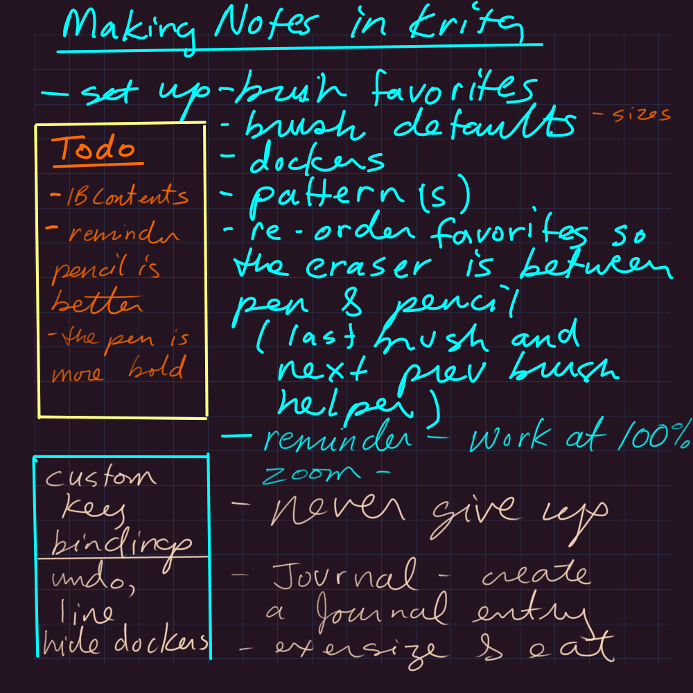
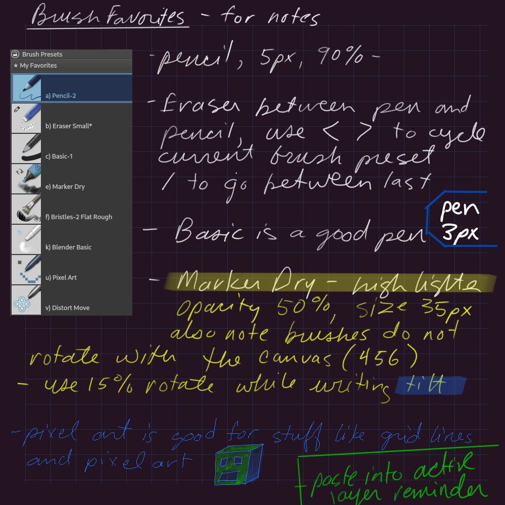
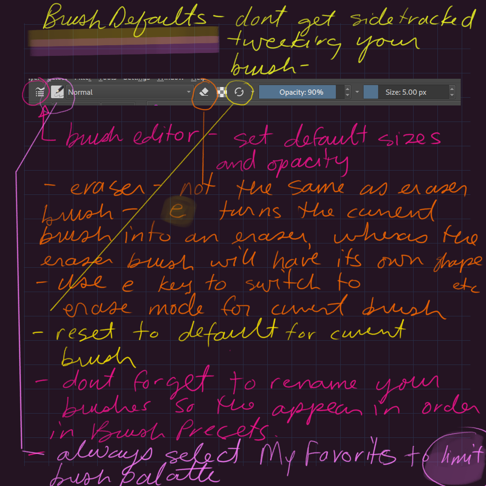
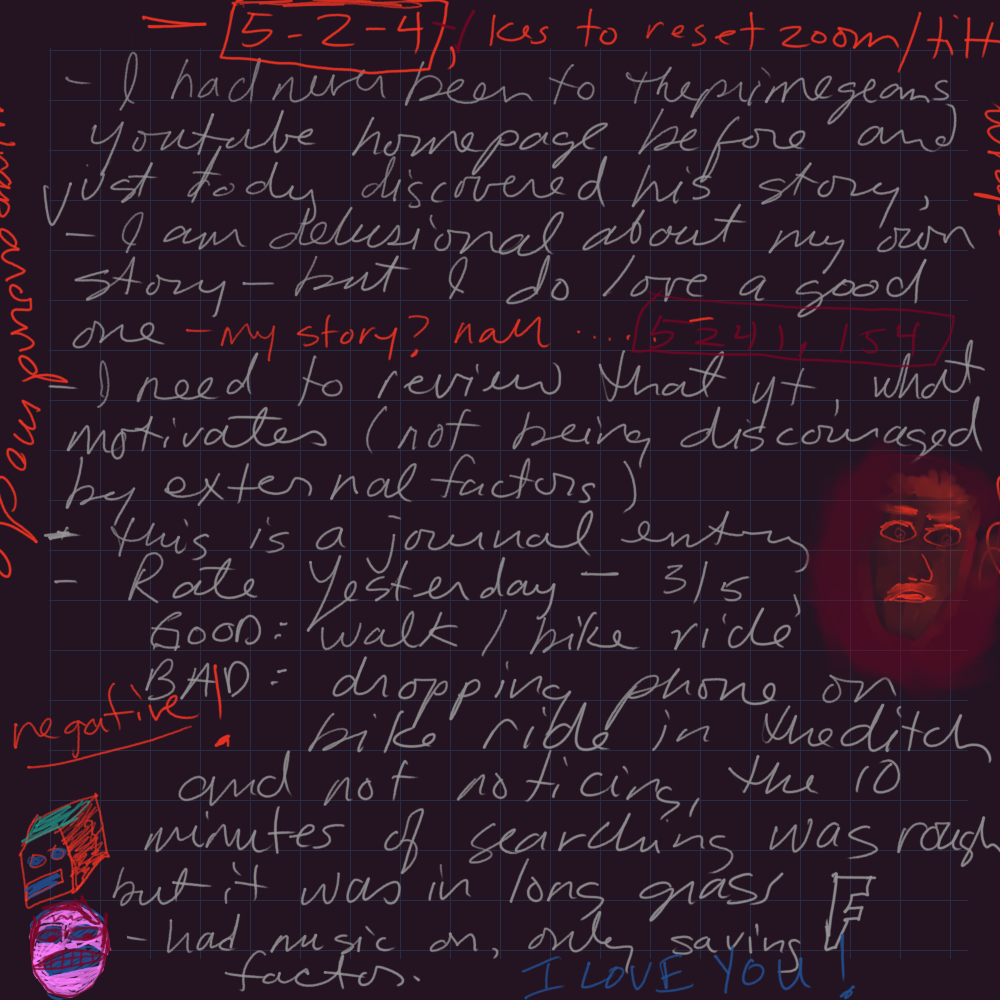

Krita for Notes
===============

- set up brush favorites
- set up brush defaults (sizes, opacity, name prefix)
- using < > and / 
- custom name prefixes to put eraser between pen and pencil
- essential dockers
- adding custom pattern
- working at scale 100, prefer frames to super large canvas
- essential custom key bindings: undo (z), line (q), hide dockers (d)
- the pencil is the best tool for writing because it shows your pressure serifs without clobbering main strokes, making it look natural
- compare the top half to the bottom half of the first frame in this note - the top is the cyan basic pen, which is my prefered pen, but still not as nice as the pencil, though could be finer

[krita journal example kra file with storyboard as pages used to create these notes][1]

[1]: (05-11-2024.kra)
